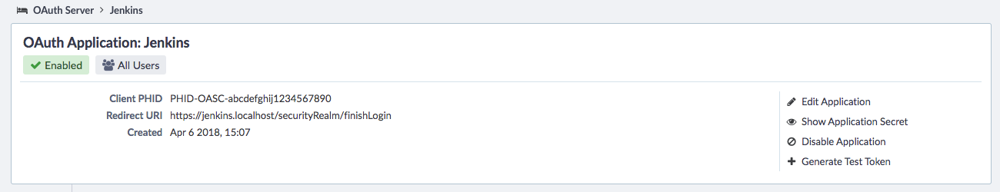
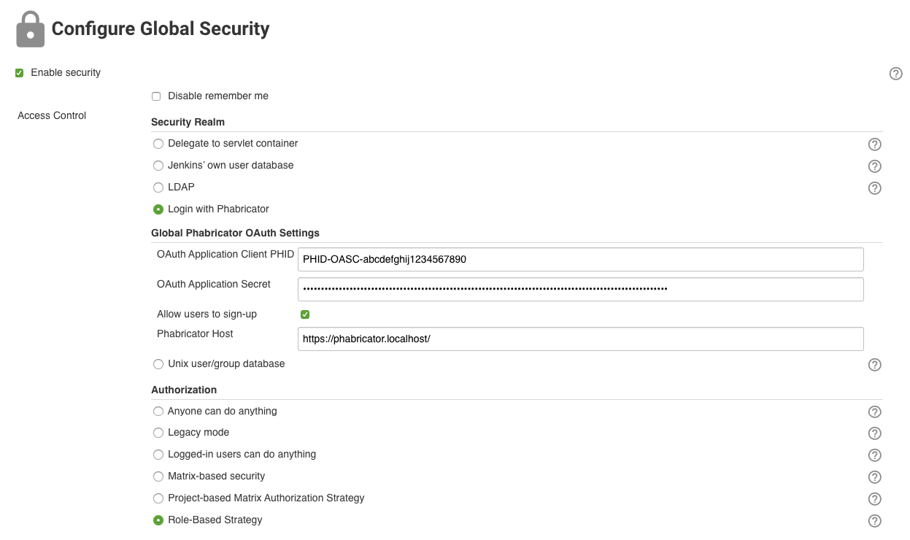

Phabricator Authentication Plugin
============

# Introduction

A Jenkins plugin that lets you login to Jenkins with your Phabricator account.

## Getting Started ##

Since this plugin is not published on https://plugins.jenkins.io/, you need to manually build and upload the plugin.

```
mvn install
```

Upload `targets/phabricator-auth-plugin.hpi` to Jenkins by following the steps at https://jenkins.io/doc/book/managing/plugins/

## Configuration ##

In Phabricator, create an OAuth Server. The redirect URI should be in the form `https://<jenkins host>/securityRealm/finishLogin`. Take note of the `Client PHID` and `Application secret`.



In Jenkins, go to `Configure Global Security` and select `Login with Phabricator` for `Security Realm`. Fill in the fields under `Global Phabricator OAuth Settings`:
- `OAuth Application Client PHID`
- `OAuth Application Secret`
- `Allow users to sign-up`: Check if you want existing Phabricator users to be automatically registered in Jenkins upon first logon
- `Phabricator Host`: Phabricator URL e.g. https://phabricator.localhost/



If you are also using SonarQube, check out a [similar plugin for SonarQube](https://github.com/n3v3rf411/sonar-auth-phabricator).

## License

This project is licensed under the MIT License - see the [LICENSE](LICENSE) file for details
